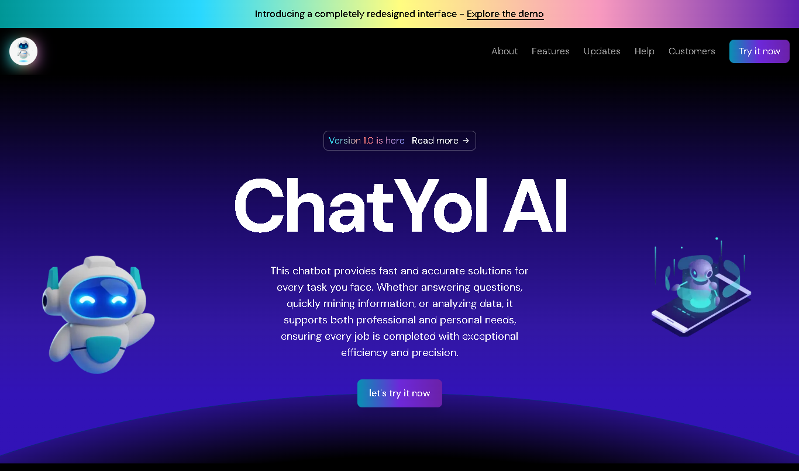

<h1 align="center"> ChatYol AI Landing Page </h1>

A landing page designed to give you an idea of the advanced capabilities of ChatYol AI, a chatbot created to increase your productivity with fast and accurate solutions but still in its infancy.

### Live Demo
[Website Demo](https://chatyol-landingpage.vercel.app/)

## Features
- **Interactive Robots:** Features draggable robot images that return to their original position, adding an engaging interactive element.
- **Animated Lights:** Dynamic light animations that follow your cursor in the features section, providing a visually appealing experience.
- **Intuitive Interface:** Smooth image animations in the intuitive interface section, ensuring a user-friendly and enjoyable experience.
- **Logo Ticker:** Displays a scrolling ticker of logos from trusted partners, adding credibility and a dynamic visual element to the page.

## Technologies Used
- **Next.js:** A React framework for efficient and fast web application development.
- **Tailwind CSS:** For styling and layout customization.
- **TypeScript:** Adds type safety to JavaScript.
- **Framer Motion:** For animations and transitions.

## Contribution
You are welcome to contribute to this project by opening issues or creating pull requests. Any suggestions or improvements are highly appreciated!

## License
This project is licensed under the [MIT License](LICENSE).
